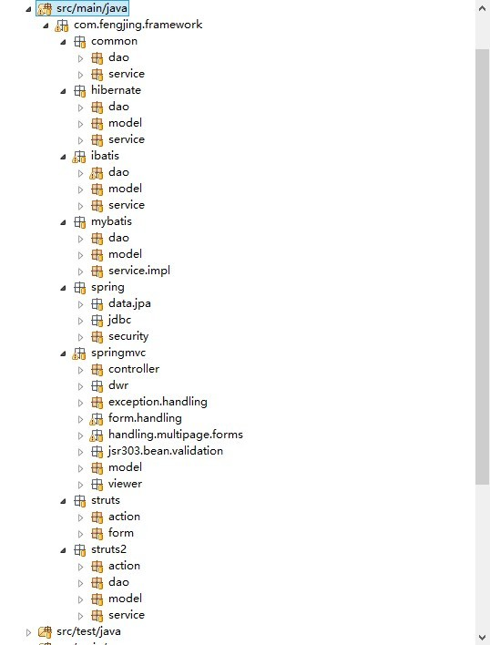

# maven-framework-project
==================================
* 该项目基于maven3.0构建的，项目中融合了<em>Struts1</em>、<em>Struts2</em>、<em>Spring</em>、<em>SpringMVC</em>、<em>Hibernate</em>、<em>Ibatis</em>、<em>MyBatis</em>、<em>Spring Data JPA</em>、<em>Spring JDBC</em>、<em>Spring DWR</em>。页面展现这里使用Struts1、Struts2、SpringMVC（jsp视图、velocity视图、freemarker视图、pdf视图、excel视图、xml视图、json视图等）。是一个综合性的项目。

* 该项目后期会陆续集成Spring的一些好的框架进来比如说Spring Web Flow、Jbpm、WebService、Compass、Solr、nutch等。总之是一个综合性的项目。该项目不处理业务，主要是把目前自己工作中用到过的各种框架糅合到一个项目中。纯粹是一个jee框架的糅合，主要是介绍各种技术。

* 项目中的持久化框架sql语句的跟踪分别采用<strong>log4jdbc</strong>结合<strong>log4j</strong>和<strong>p6spy</strong>,在控制台可以看到完整的sql语句。

* Spring  JAX-WS请参考<em>[http://jax-ws-commons.java.net/](http://jax-ws-commons.java.net/)</em>

* Spring整合dwr时dwr版本很关键,否则报莫名其妙的错误,具体的整合方式参照<em>[http://www.butterdev.com/category/dwr/](http://www.butterdev.com/category/dwr/)</em>

# 项目包结构图

# 项目中所使用框架版本信息
1. Struts1 1.3.10 参照<em>[spring-struts.xml](src/main/resources/spring-struts.xml)</em>、<em>[struts-config.xml](src/main/webapp/WEB-INF/struts-config.xml)</em>配置
   *<em>[http://localhost:8080/maven-framework/helloWorld.str](http://localhost:8080/maven-framework/helloWorld.str)</em>
2. Struts2 2.3.8  参照<em>[spring-struts2-servlet.xml](src/main/resources/spring-struts2-servlet.xml)</em>、<em>[struts.xml](src/main/resources/struts.xml)</em>配置
   *<em>[http://localhost:8080/maven-framework/helloAction!hello.action](http://localhost:8080/maven-framework/helloAction!hello.action)</em>
3. Spring 3.2.1.RELEASE 参照<em>[applicationContext.xml](src/main/resources/applicationContext.xml)</em>配置
4. Spring JDBC 参照<em>[spring-jdbc.xml](src/main/resources/spring-jdbc.xml)</em>配置
   *单元测试[ProducrServiceTest.java](src/test/java/com/fengjing/framework/spring/jdbc/service/impl/ProducrServiceTest.java)
5. Hibernate 4.2.0.Final 参照<em>[spring-hibernate.xml](src/main/resources/spring-hibernate.xml)</em>配置
   *单元测试[EmployeeServiceImplTest.java](src/test/java/com/fengjing/framework/hibernate/service/impl/EmployeeServiceImplTest.java)
6. ibatis 2.3.4.726  参照<em>[spring-ibatis.xml](src/main/resources/spring-ibatis.xml)</em>配置
   *单元测试[ProductServiceImplTest.java](src/test/java/com/fengjing/framework/ibatis/service/impl/ProductServiceImplTest.java)
7. MyBatis 3.1.1   参照<em>[spring-mybatis.xml](src/main/resources/spring-mybatis.xml)</em>配置
   *单元测试[ProducrServiceTest.java](src/test/java/com/fengjing/framework/mybatis/service/impl/ProducrServiceTest.java)
8. Spring Data JPA 1.3.0.RELEASE  参照<em>[spring-data-jpa.xml](src/main/resources/spring-data-jpa.xml)</em>配置
   *单元测试[UserServiceImplTest.java](src/test/java/com/fengjing/framework/spring/data/jpa/service/impl/UserServiceImplTest.java)
9. DWR 3.0(该版本jar包在跟Spring整合使用注解方式时会有问题,建议使用项目中的dwr.jar)  参照<em>[spring-mvc-dwr.xml](src/main/resources/spring-mvc-dwr.xml)</em>配置
   * dwr测试地址<em>[http://localhost:8080/maven-framework/dwr/index.html](http://localhost:8080/maven-framework/dwr/index.html)</em>
   * dwr文件上传下载<em>[http://localhost:8080/maven-framework/direct/dwr.do](http://localhost:8080/maven-framework/direct/dwr.do)</em>
10. Spring Security 3.1.3.RELEASE 参照<em>[spring-security.xml](src/main/resources/spring-security.xml)</em>配置
11. log4jdbc 1.2 采用log4jdbc跟踪sql语句 查看<em>[log4j.xml](src/main/resources/log4j.xml)</em>
12. p6spy 1.3 采用p6spy跟踪sql语句 详细查看<em>[spy.properties](src/main/resources/spy.properties)</em>文件
13. spring rmi远程方法调用 参照<em>[spring-rmi.xml](src/main/resources/spring-rmi.xml)</em>
	* 调用<em>[HelloServiceTest.java](src/test/java/com/fengjing/framework/spring/rmi/HelloServiceTest.java)</em>
14. Spring MVC 参照<em>[spring-mvc-servlet.xml](src/main/resources/spring-mvc-servlet.xml)</em>
	* jsp视图<em>[http://localhost:8080/maven-framework/hello/jsp.do](http://localhost:8080/maven-framework/hello/jsp.do)</em>
	* velocity视图<em>[http://localhost:8080/maven-framework/hello/velocity.do](http://localhost:8080/maven-framework/hello/velocity.do)</em>
	* freemarker视图<em>[http://localhost:8080/maven-framework/hello/freemarker.do](http://localhost:8080/maven-framework/hello/freemarker.do)</em>
	* 基于jxl方式的excel视图<em>[http://localhost:8080/maven-framework/jxl.do?output=excel](http://localhost:8080/maven-framework/jxl.do?output=excel)</em>
	* 基于poi方式的excel视图<em>[http://localhost:8080/maven-framework/poi.do?output=excel](http://localhost:8080/maven-framework/poi.do?output=excel)</em>
	* 基于itext的pdf视图<em>[http://localhost:8080/maven-framework/itext.do?output=pdf](http://localhost:8080/maven-framework/itext.do?output=pdf)</em>
	* rss视图<em>[http://localhost:8080/maven-framework/rss.do](http://localhost:8080/maven-framework/rss.do)</em>
	* xml视图<em>[http://localhost:8080/maven-framework/xml.do](http://localhost:8080/maven-framework/xml.do)</em>
	* json视图<em>[http://localhost:8080/maven-framework/json.do](http://localhost:8080/maven-framework/json.do)</em>
	* log4j视图<em>[http://localhost:8080/maven-framework/log4j.do](http://localhost:8080/maven-framework/log4j.do)</em>
	* 基于SimpleUrlHandlerMapping方式的rest方式<em>[http://localhost:8080/maven-framework/simpleurl/showuser/admin/admin.do](http://localhost:8080/maven-framework/simpleurl/showuser/admin/admin.do)</em>
	* 基于普通的rest方式<em>[http://localhost:8080/maven-framework/hello/showuser/admin/admin.do](http://localhost:8080/maven-framework/hello/showuser/admin/admin.do)</em>
	* 基于rest方式的spring mvc crud详细查看<em>[ContactControll](src/main/java/com/fengjing/framework/springmvc/controller/ContactControll.java)</em>中的配置
15. Spring Jax WS 参照<em>[spring-jax-ws-servlet.xml](src/main/resources/spring-jax-ws-servlet.xml) 注意查看[pom](pom.xml)中wsimport的配置</em>
	* <em>[http://localhost:8080/maven-framework/service/hello?wsdl](http://localhost:8080/maven-framework/service/hello?wsdl)</em>
    * 生成客户端访问执行<em>mvn jaxws:wsimport</em>
    * 客户端访问<em>[HelloWebServiceClient](src/main/java/com/fengjing/framework/spring/jax/ws/client/HelloWebServiceClient.java)</em>

# 使用说明
1. 手动创建数据库(framework、hibernate4、jdbc_ibatis_mybatis、spring_security)
   * framework(自动创建表和导入数据) 用来演示spring data jpa 
   * hibernate4(自动创建表和导入数据) 用来演示 hibernate4
   * jdbc_ibatis_mybatis(自动创建表和导入数据) 用来演示spring jdbc、ibatis、mybatis,使用同一个数据库、同一个数据源、同一个事务管理
   * spring_security(自动创建表和导入数据) 用来演示spring security
2. 修改<em>[jdbc.properties](src/main/resources/jdbc.properties)</em>文件 里面存放数据库连接信息.主要这里的driver和jdbc url与大家平常见到的不太一致,这是由于使用了sql语句跟踪的框架
	* log4jdbc (spring jdbc、ibatis、mybatis、spring data jpa、spring security使用他跟踪sql)
	* p6spy (hibernate使用p6spy跟踪sql)
	* log4jdbc要结合<em>log4j</em>来使用
	* p6spy要结合<em>[spy.properties](src/main/resources/spy.properties)配置文件
	* 注意查看<em>[log4j.xml](src/main/resources/log4j.xml)文件
3. 鉴于配置方便这里将各持久化框架的数据源集中配置在[applicationContext.xml](src/main/resources/applicationContext.xml)文件中,其中spring jdbc、ibatis、mybatis,使用同一个数据库、同一个数据源、同一个事务管理
4. 以上配置完成后您可采用一下方式运行该工程,详细使用方式请查看[pom](pom.xml)中的配置或者各插件的帮助文档
   * 跳过单元测试 <em>mvn -Dmaven.test.skip=true</em> 参照[http://maven.apache.org/surefire/maven-surefire-plugin/examples/skipping-test.html](http://maven.apache.org/surefire/maven-surefire-plugin/examples/skipping-test.html)
   * tomcat6 <em>mvn tomcat:run</em>
   * tomcat7 <em>mvn tomcat7:run</em>
   * jetty <em>mvn jetty:run</em>
   * jboss <em>mvn jboss:start</em> <em>mvn jboss:hard-deploy</em>
   * jboss-as <em>mvn jboss-as:deploy</em> <em>mvn jboss-as:run</em>
	
# 项目托管
* <del>SVN地址：<em>http://maven-framework-project.googlecode.com/svn/trunk/</em></del> (限于大陆google code 不稳定,导致经常无法访问,该地址已不在同步,建议使用github地址)
* GitHub地址：<em>https://github.com/sxyx2008/maven-framework-project/</em>

最后希望有兴趣的朋友可以加入进来，大家一起完善他。把自己的技术分享出来。如有任何问题可以与我联系

# 联系方式
* QQ：<em>184675420</em>
* Email：<em>sxyx2008@gmail.com</em>
